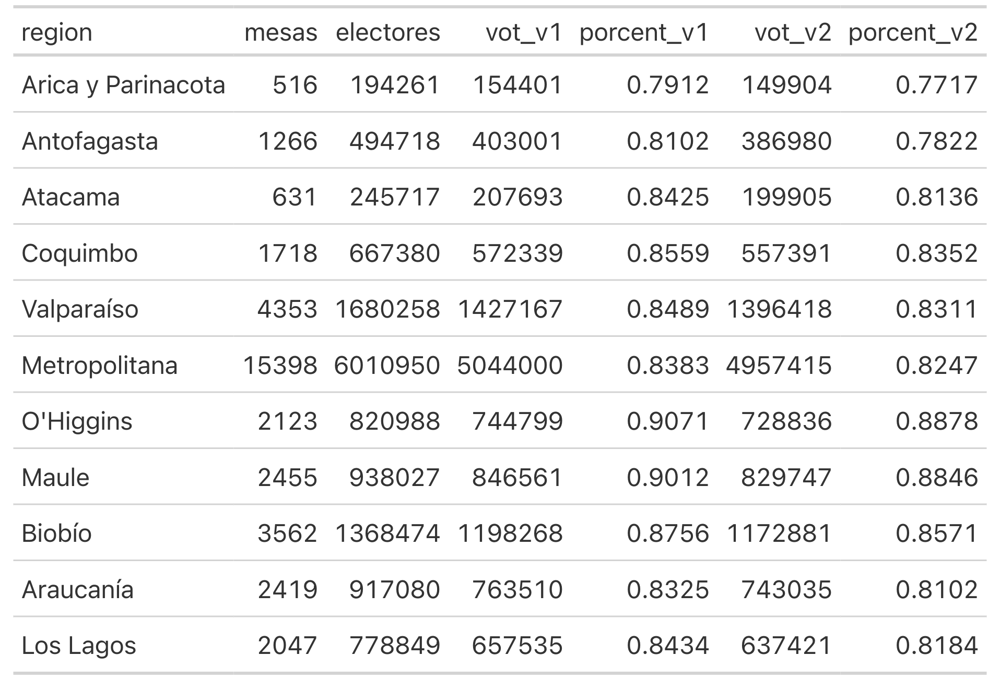
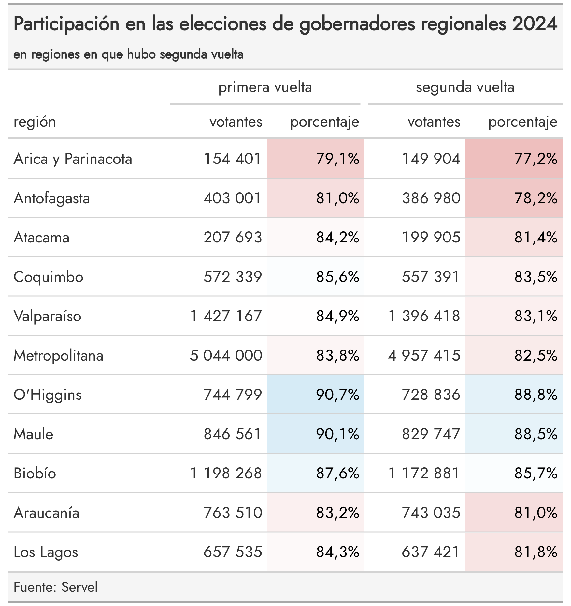
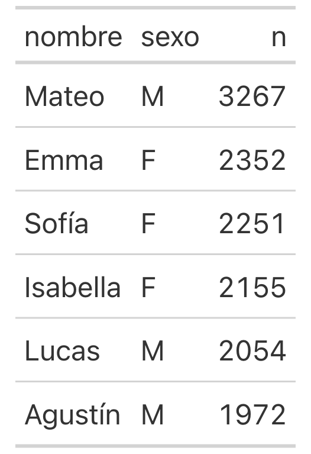
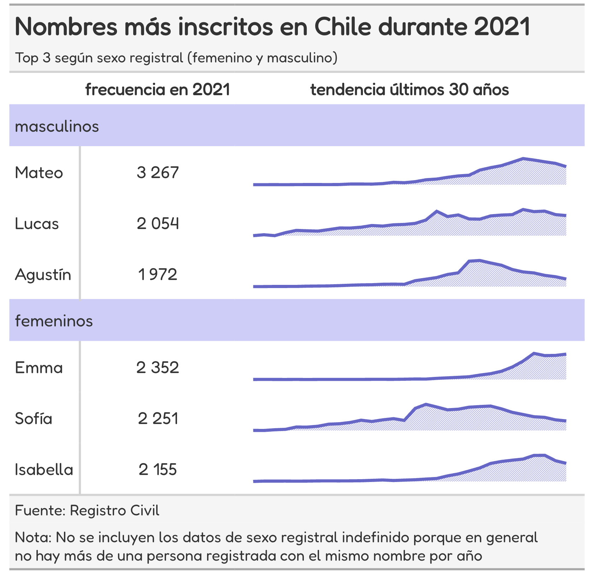

# Comunicar resultados con precisión: creación de tablas avanzadas usando Polars y Great Tables

En este repositorio se encuentran el código completo de los ejemplos mostrados en la charla presentada en la edición 2024 de la [PyCon Chile](https://pycon.cl/).

## Ejemplo 1

[Archivo Quarto con el código](https://github.com/rivaquiroga/great-tables-pycon-chile-2024/blob/main/participacion-elecciones.qmd)

[Versión html](https://rivaquiroga.github.io/great-tables-pycon-chile-2024/participacion-elecciones.html)

### Antes

### Después

## Ejemplo 2

[Archivo Quarto con el código](https://github.com/rivaquiroga/great-tables-pycon-chile-2024/blob/main/registro-nombres.qmd)

[Versión html](https://rivaquiroga.github.io/great-tables-pycon-chile-2024/registro-nombres.html) 

### Antes

### Después

